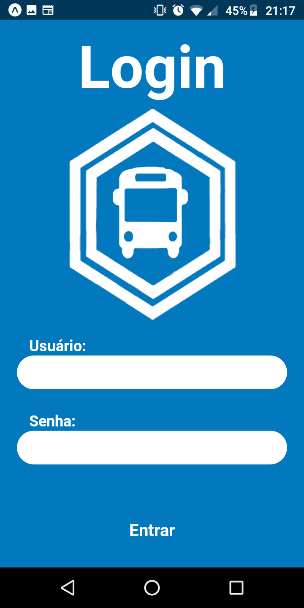
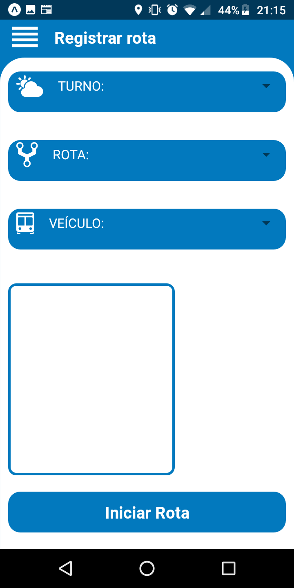
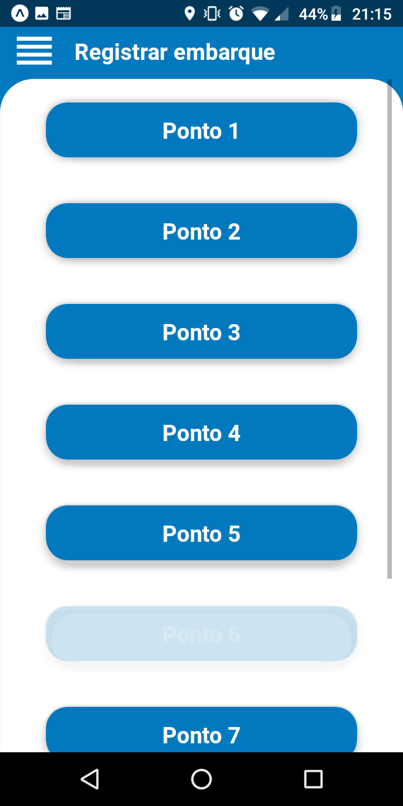
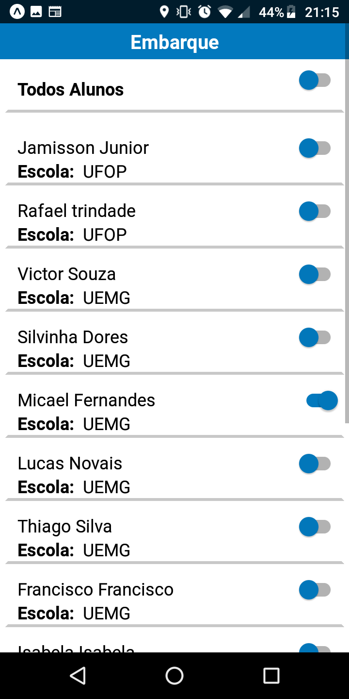
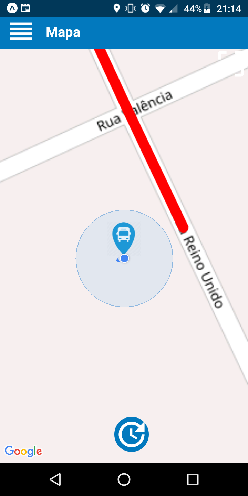
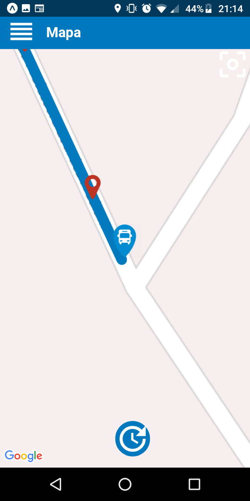

<div style="display:flex;flex-direction:column;flex:1">

<h1>Monitoramento de ônibus - versão mobile</h1>

<div style="display:flex;flex:1;justify-content=center">
  <div>
    
    
    
  
  <div>
    
    
    
  <div>

</div>
<hr>

<div style="text-align:justify">
  
  <h2>Objetivos</h2>
  <p>
  Esse projeto descreve a proposta de um estudo de meta-heurísticas aplicadas ao Problema de Roteamento de ônibus Escolar que tem como objetivo realizar o transporte de alunos para as suas respectivas escolas utilizando uma frota de veículos percorrendo a menor distância possível e, ao mesmo tempo, garantindo que as restrições do problema sejam satisfeitas. Entre as restrições existentes, podemos citar a capacidade máxima dos veículos, o tempo máximo de permanência do estudante no veículo e a janela de tempo de uma escola (horário de início ou fim das aulas).
  </p>
  <p>
  O aplicativo foi divida em diversas screens possibilitando o motorista informar ao servidor os alunos embarcados, desembarcados e a localização do ônibus. Essas informações são coletadas e possibilita a geração das rotas otimizadas utilizando heurísticas. Dessa forma, com o decorrer do tempo o aplicativo consegue fornecer informações sobre a rota mais otimizada que deve ser seguida.
  </p>
  <hr>

  <h2>Teste o aplicativo</h2>
  <p>
  Todas as versões do apk para o aplicativo podem ser encontradas <a href= "https://expo.io/dashboard/jjader">aqui</a>. Ao terminar o download do arquivo, basta transferi-lo para o seu celular.
  </p>

  <p style="color:red;text-align:center"> O seu celular precisa está configurado no modo desenvolvedor <p>
  <hr>

  <h2>Você é novo no projeto ?</h2>
  <p>
  Todo o aplicativo foi desenvolvido utilizando o framework <a href="https://reactnative.dev/docs/getting-started">react-native</a>. Para facilitar nossa vida no desenvolvimento optamos por utilizar a ferramenta <a href="https://docs.expo.io/">expo</a>, que gerar as configurações básicas para iniciar o aplicativo.
  </p>
  <p>
  Caso você tenha caído de paraquedas aqui 😱, não se preocupe! com algumas semanas de estudo você será capaz de fazer coisas bem bacanas. Sugiro que você comece aprendendo:
  <p>
  
  * Como utilizar o expo no react-native
  * Como utilizar os states e props
  * Básico sobre react native navigation
  * Básico sobre react native maps
  <hr>

  <h2> Configurando o ambiente </h2>

  Instale as principais dependências para o funcionamento do react-native :

  * Node
  * JavaSdk
  * Android Studio
  * Expo

  Clone o repositório e execute os comandos

  ```bash
    npm install
  ```
  
  Após todos as dependências serem instaladas, basta digitar o comando a seguir e ler o qrcode com o aplicativo da expo.

  ```bash
    sudo expo start
  ```    
  <hr>

  <h2>Arvore de arquivos</h2> 
  Aqui está as principais pastas que você deve prestar atenção inicialmente

  
  ```
  ├── assets
  │   ├── app
  │   ├── psd
  ├── src
  │   └── assets
  │   │     └── logo
  │   ├── componets
  │   ├── screens
  │   └── style
  ```

  <hr>

  <h2>Contribuições</h2>
  <p>
  Pull requests são bem vindos. Por favor, tenha certeza que o update esteja apropriados. Caso tenha alguma dúvida estou a disposição
  </p>

  - <a href="https://github.com/jjader">GitHub</a>
  - <a href="mailto:jjader03@gmail.com">Email</a>
<div>
<div>
