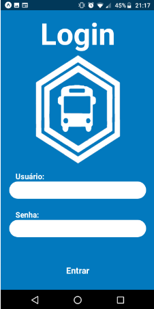
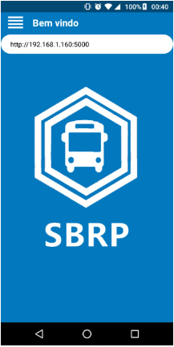
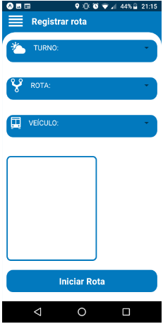
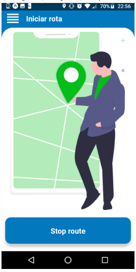
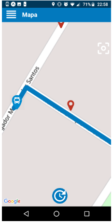
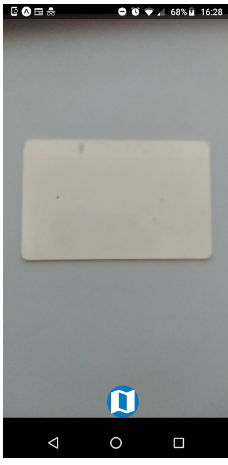
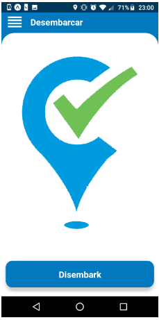

# Screens

Aqui é apresentado as telas que compõem a aplicação, seu objetivo e designer finalizado. Para conhecer um pouco mais sobre algumas das funcionalidades dentro dessas screens [clique aqui](/Screens/README.md).

## Login

A tela de login tem como objetivo validar o acesso do usuário à aplicação. Com essa tela conseguimos obter o token e algumas informações pessoas do usuário que são importantes em outras screens. Essas informações são armazenadas no [Dados de usuário](/Offline/userStore.md).

## Entrada

A tela entrada é um screen estática e é a porta de entrada da aplicação.

## Registrar rota

A tela Registrar rota foi criada para que o usuário escolha parâmetros importantes da sua jornada de trabalho, como turno, rota, veículo e algumas anotações. Caso a requisição para o envio dessas informações seja aceito, o id desses dados são armazenados no [Dados de usuário](/Offline/userStore.md).

## Iniciar rota

A tela de Iniciar rota serve para indicar ao webserve e para a aplicação se o usuário está executando sua rota. Caso o usuário não estejá em horário de trabalho, a aplicação nega o acesso à tela do mapa.

## Mapa

A tela de mapa apresenta os mapas, com os tiles da Open Street Map, as rotas (polylines) e os pontos de escola e os pontos de ônibus. Além disso, esse screen obtém a posição do ônibus e a envia para o webserver. No mapa o usuário possui acesso a tela de embarque (clicando nos ícones de pontos de ônibus) e de desembarque (clicando nos ícones de escola).

## Embarque

A tela de embarque é uma câmera, capaz de ler qrcodes. Inicialmente o aplicativo apenas avalia se o qrcode lido é um número. A ideia é que cada aluno possuirá um cartão identificador com o seu id. 

## Desembarque

A tela de desembarque é constituída de um botão, que ao ser clicado enviar uma requisição ao webserver informando que uma determinada escola já foi atendida.

## Sair

Essa tela verifica se existe alguma informação armazenada nas pilhas de estudantes e localização. Caso não haja, ela exclui as informações do usuário no dispositivo e sai da aplicação.